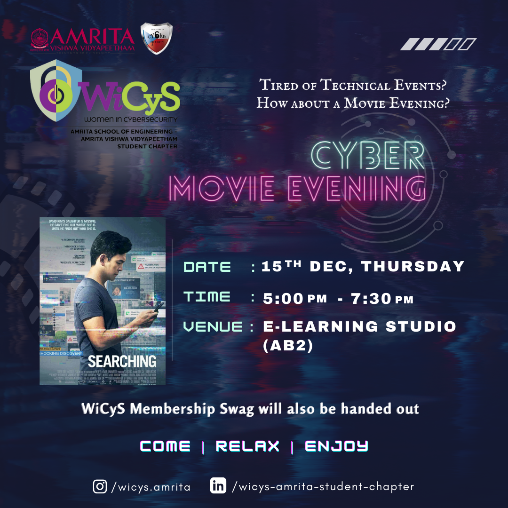
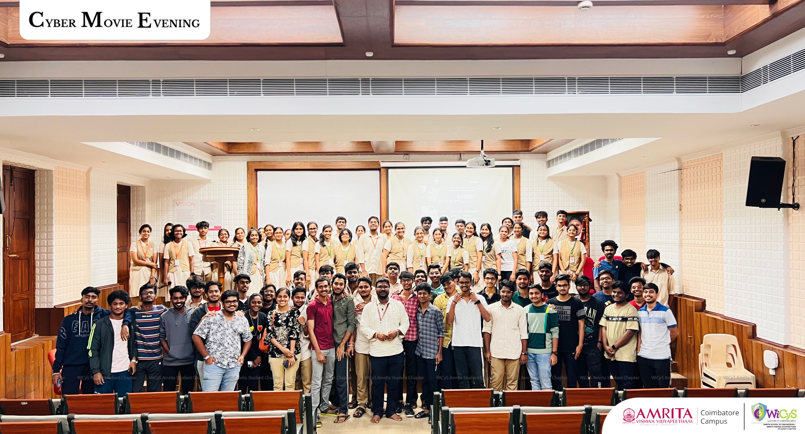

 

Event Report
-------------

On Thursday, <b>15th December 2022</b>, the BTech CYS second years organized the monthly Cyber Movie Evening, which took place in the <b>E-learning studio</b> located in Academic Block-2. The event was aimed at educating attendees about cyber safety in an entertaining manner. The movie evening started at <b>5 pm</b> and went on till <b>7:30 pm.</b>

  

The movie that was streamed during the event was <b>"Searching"</b>. The movie revolves around the protagonist David Kim, who becomes desperate when his daughter Margot disappears. The police investigation leads to nowhere, and David decides to search his daughter's laptop, hoping that her digital footprints might give them clues. The movie shows David contacting her friends and thoroughly looking through her photos and videos to find clues about her whereabouts.

The event was attended by the departments of <b>CSE, AI, and CYS</b>, with the strength being close to <b>50 B. Tech students</b>, including the organizers. The movie evening was a platform for attendees to learn about the importance of cyber safety through an engaging storyline.

Overall, the Cyber Movie Evening was a success, with attendees enjoying the movie and gaining insights into the importance of cyber safety. The event was well-organized and executed, and the organizers are looking forward to the next movie evening.

  

