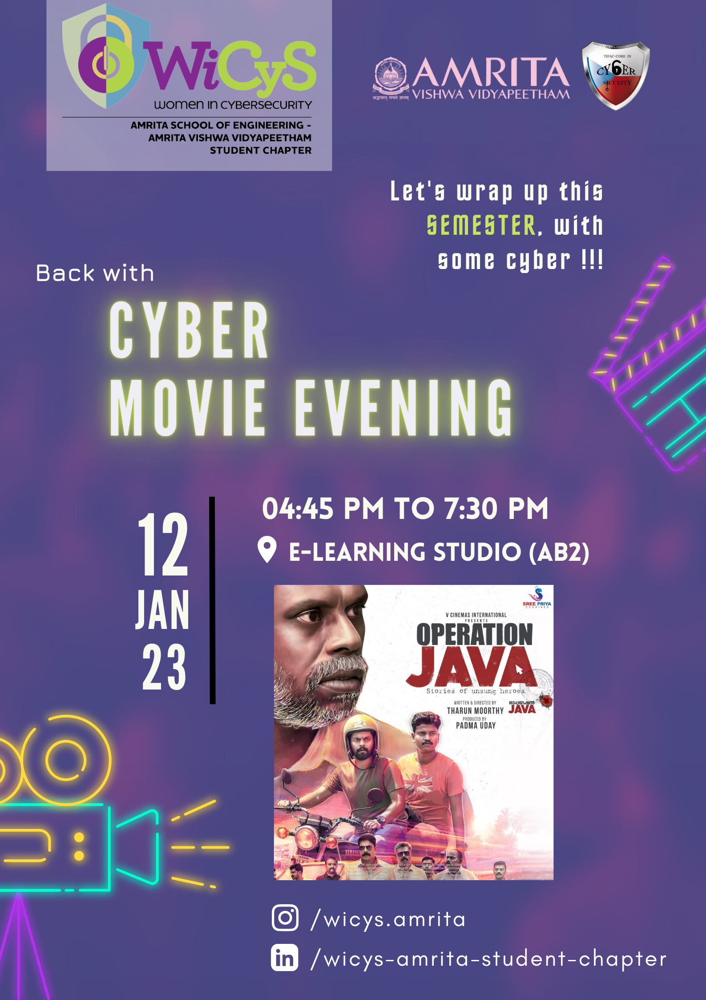

On Thursday, <b>12th January 2023</b>, the BTech CYS first and second years organized the monthly Cyber Movie Evening, which took place in the <b>E-learning studio</b> located in Academic Block-2. The event aimed to educate regular attendees about the importance of cyber safety in an entertaining manner. The movie evening started at <b>5:15 pm</b> and went on till <b>7:25 pm</b>.

  

The movie that was screened during the event was "<b>Operation Java</b>". The movie was based on real-life cases and portrayed the investigations undertaken by the Cochin Cyber Cell in the span of one and a half years. The movie gave viewers a view into the realm of Cyber Security officers and also showed many common cybercrimes and the consequences of not being cyber-aware. The movie also highlighted the hurdles of temporary workers. The realism and practicality of each and every scene gave immense contentment to the viewer.

The event was attended by the departments of **CSE, AI, and CYS, along with a few others**. The strength of the event was close to **90** **B. Tech students**, including the organizers. The Cyber Movie Evening was a platform for attendees to learn about the importance of cyber safety through an engaging storyline.

Overall, the Cyber Movie Evening was a success, with attendees enjoying the movie and gaining insights into the importance of cyber safety. It was a splendid event for Cyber enthusiasts and movie buffs alike. Core Team says, "A huge appreciation for our juniors who made this event lively, engaging, and well-informed".

  

