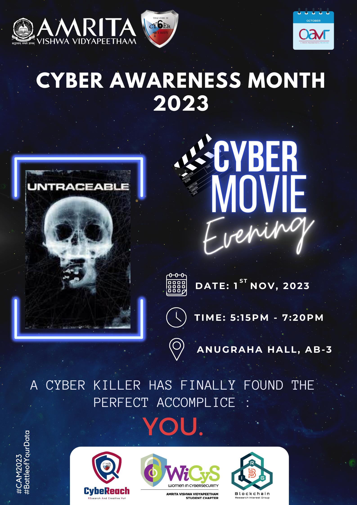
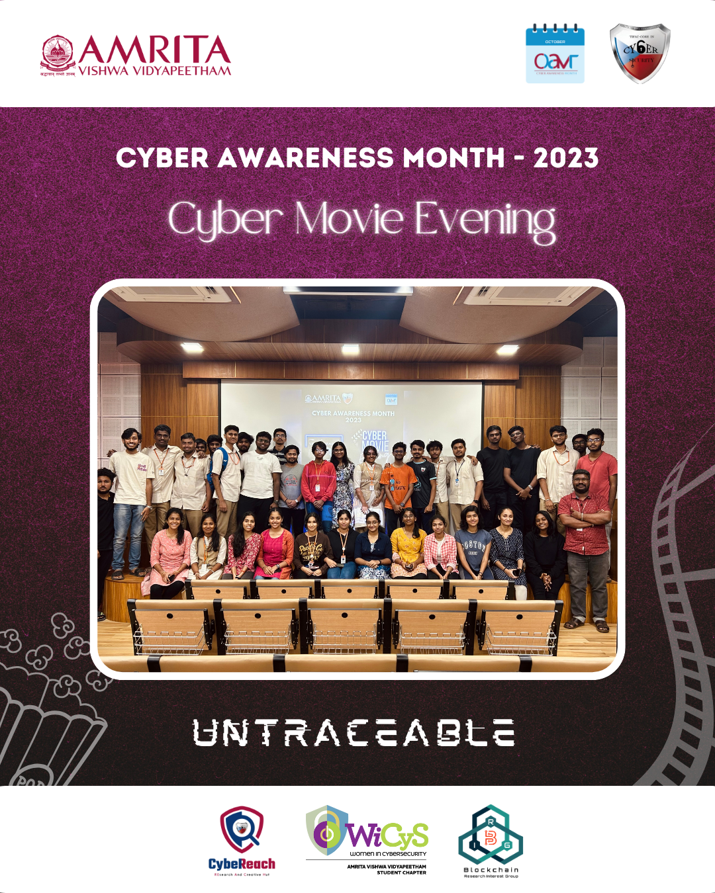

 

## Report
The Cyber Movie Evening was held on 1st of November, Wednesday at Anugraha Hall, AB-3 as part of the Cyber Awareness Month activities. The event was organized collaboratively by
CybeReach, WiCyS-Amrita Student Chapter, and B-RIG, and created an immersive cinematic experience for all the attendees.

The featured movie was **UNTRACEABLE**, a 2008 American psychological thriller film directed by Gregory Hoblit. Starring Diane Lane, Colin Hanks, Billy Burke, 
and Joseph Cross, the movie explored the dark realms of the internet, captivating the audience with its gripping plot.

During the event, a significant announcement was made regarding the Generative AI Competition, an opportunity for AI enthusiasts and professionals alike
to showcase their prompting skills. Detailed information about the competition was shared, encouraging active participation from the attendees.

Following the movie screening, an interactive session, led by **Assistant Professor Mr. Ramaguru Radhakrishnan** was held. This session encouraged attendees to
engage in discussions, sharing their insights and thoughts on the themes presented in the movie. Additionally, a survey was conducted to gather feedback,
ensuring continuous improvement for future events.

The event was organized by a dedicated team of second-year BTech Cyber Security Students. The team comprised of Mr. Deepak Kumar S, Mr. Ramraj S,
Mr. Hemadhri PC, Ms. Amita Narayanan Kutty, and Mr. Harshith Gangisetty.

The evening concluded with a memorable group picture, capturing the shared excitement and camaraderie of the attendees. Smiles and laughter 
filled the room as participants posed together, preserving the memories of the Cyber Movie Evening.
In conclusion, the Cyber Movie Evening, proved to be a resounding success, fostering a sense of community and excitement among the participants.

