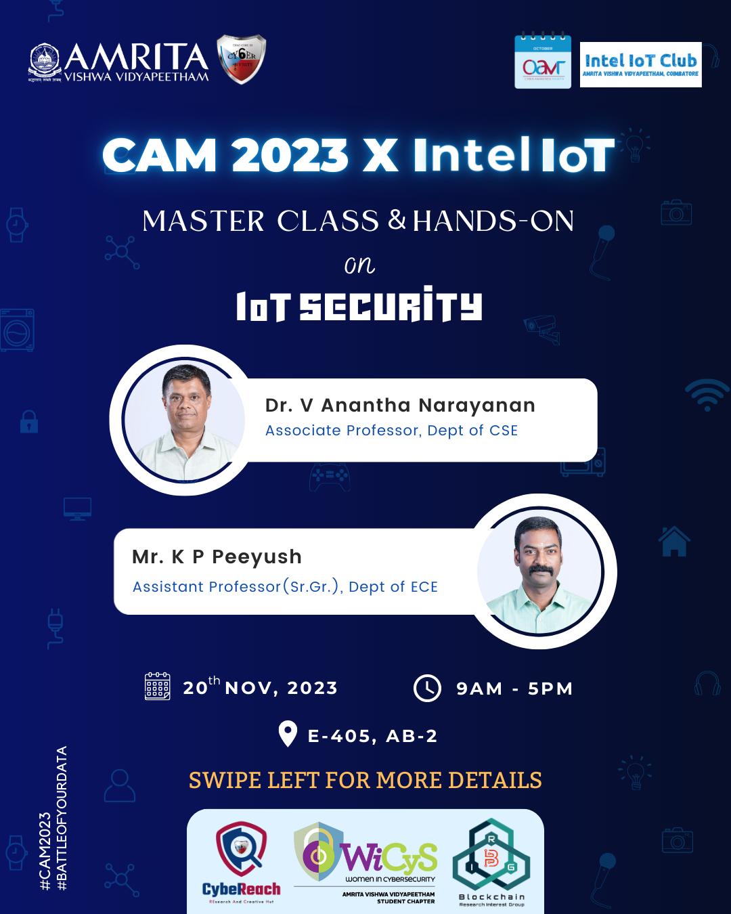
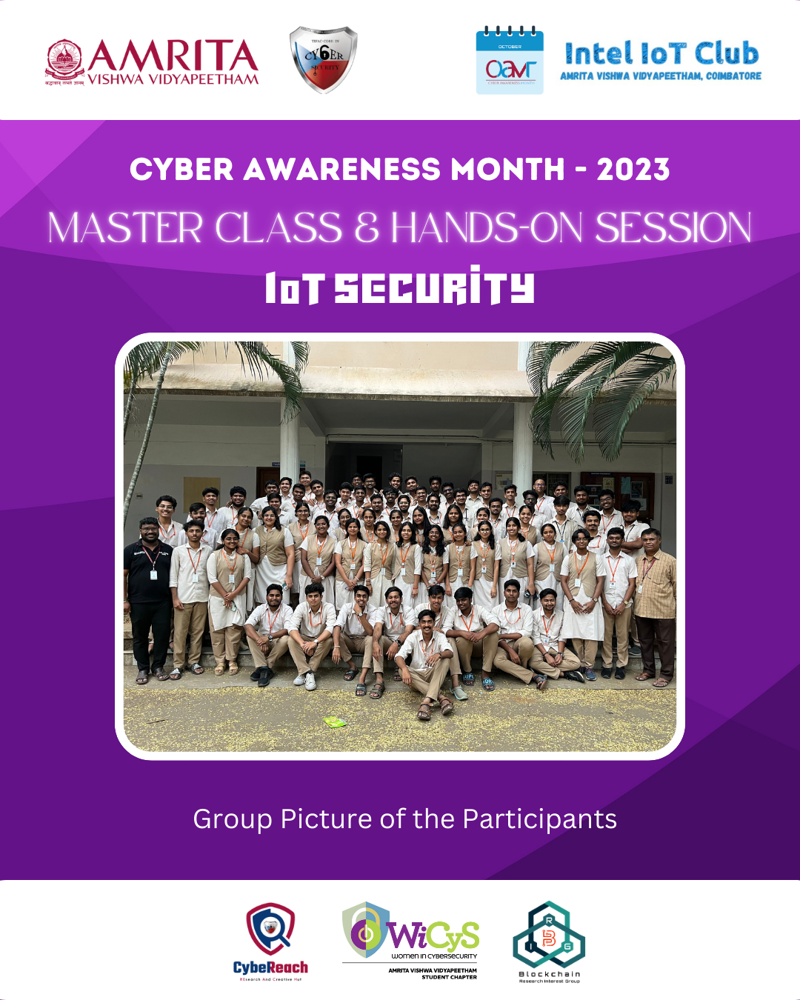

 

## Report
The highly successful **IoT Security Master Class and Hands-On Session**, a collaborative effort between **CAM2023** and the **Intel IoT Club**, took 
place at E-405, AB-2 on November 20th from 9 AM to 5 PM. The event prioritized an immersive exploration of IoT security, offering participants comprehensive
insights and practical experiences.

The event commenced with a devotional prayer led by Ms. Aishwarya GS and Ms. Harshitha Ranjith, creating a harmonious and focused atmosphere, which was followed 
by Ms. Harshitha Ranjith and Ms. Roshni V providing an insightful overview of the sessions to follow. The proceedings were expertly convened by **Mr. Ramaguru Radhakrishnan**.

**Dr. Anantha Narayanan Velu**, Associate Professor in the Department of CSE, played a pivotal role as the main facilitator throughout the day. His expertise and 
guidance ensured a smooth flow of the sessions, providing valuable insights into IoT security.
Additionally, **Mr. K. P. Peeyush**, Assistant Professor in the Department
of ECE, briefly joined the session, offering a practical perspective on the real-time usage of embedded systems.

<ul>
<li>Session 1: IoT Evolution and History
  
The day began with an engaging introduction to embedded systems by Mr. K. P. Peeyush, setting the stage for a deep dive into IoT security.
Participants seamlessly transitioned from theory to practice, gaining hands-on experience with the ESP32 device and micro USB cable.
</li>  
<li>Session 2: Arduino Software Basics
  
Under the guidance of Dr. Anantha Narayanan Velu, an exploration of Arduino software basics unfolded, including the crucial step of Arduino
software installation. An interactive software session allowed students to actively delve into the tools offered by Arduino, fostering dynamic learning.
</li>  
<li>Session 3: Arduino Prompts
  
Building on the foundational knowledge, participants engaged in mastering basic prompts, including blink, analog setup, and various Arduino tools.
Direct device-to-device connections were established, enhancing practical knowledge.
</li>
<li>Session 4: IoT with Cloud Interface
  
The focus shifted towards exploring ThingSpeak with an emphasis on wireless connections. Participants not only created channels in ThingSpeak but 
also established connections between ESP32 and third-party Wi-Fi hosts. The session included the introduction of various IoT devices, enriching the 
overall learning journey.
</li>
</ul>

The Master Class and Hands-On Session on IoT Security proved to be a remarkable learning experience, aligning with the overarching goals of CAM2023 and the Intel IoT Club. The collaborative effort between CAM2023 and the IoT Club will continue to drive meaningful learning experiences, furthering our 
commitment to technological exploration and innovation. 
